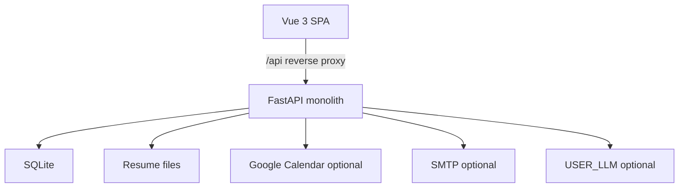

# HR Recruitment ATS — Design Spec

Date: 2026-09-03
Status: Approved for implementation planning after user review of this file
Approach: Modular monolith (FastAPI + Vue 3 + SQLite)

## 1. Problem

HR teams spend too much time writing job posts, triaging resumes, finding weekday interview slots, and sending offer or rejection emails. This product is a local applicant tracking system (ATS) that runs the full recruitment loop in one web app: job descriptions, applications, screening, interviews, decisions, and feedback.

Out of scope for v1: live posting or scraping on LinkedIn, Indeed, or any third-party job board. Those platforms require official APIs and employer credentials. v1 generates a structured job description and publishes it to an internal careers board that HR can copy or export.

## 2. Goals

- Let HR create, edit, and publish jobs on an internal board.
- Let candidates apply (public apply link or logged-in apply) with a resume.
- Screen resumes with a transparent keyword score; optionally rank with an LLM if the operator provides `USER_LLM_*` credentials.
- Schedule interviews on weekdays only, using Google Calendar when OAuth is connected, otherwise an in-app calendar.
- Deliver interview invites, offer letters, and rejections through an in-app inbox, with optional SMTP.
- Store candidate data securely and support export and deletion.
- Collect HR interview feedback before an offer, and before a post-interview rejection. Screen-out from `applied` or `screened` does not need feedback.

Success for v1: an HR user can take a candidate from job post to offer or rejection without leaving the app, even when Google, SMTP, and LLM credentials are absent.

## 3. Non-goals

- Live LinkedIn / Indeed / other board posting or resume scraping.
- Multi-tenant SaaS, SSO, or SCIM.
- Video interviews or coding assessments.
- Payroll, onboarding, or e-sign contracts.
- Real-time chat between HR and candidates (inbox messages only).

## 4. Users and roles

| Role | Access |
| --- | --- |
| `hr` | Jobs, pipeline, screening overrides, calendar, scheduling, feedback, offer/reject, all applications, GDPR tools |
| `candidate` | Own profile, applications, interview confirm/reschedule, inbox, offer accept/decline, own data export/delete |
| Public (unauthenticated) | View open jobs, submit an application (creates a candidate account) |

v1 assumes a single organization. Any `hr` user can manage all jobs. There is no recruiter-vs-hiring-manager split.

## 5. Architecture



- Frontend: Vue 3 + Vite. Dev server proxies `/api` to FastAPI and sets `server.allowedHosts` to include `.monkeycode-ai.live`.
- Backend: one FastAPI process with modules `auth`, `jobs`, `candidates`, `screening`, `calendar`, `mail`, `feedback`.
- Database: SQLite via SQLAlchemy + Alembic.
- File storage: local directory `data/resumes/` outside the web root.
- Secrets: environment variables only. Never commit real keys. Project variables:
  - `JWT_SECRET`, `DATA_ENCRYPTION_KEY`
  - `USER_LLM_API_KEY`, `USER_LLM_BASE_URL`, `USER_LLM_MODEL`
  - `SMTP_HOST`, `SMTP_PORT`, `SMTP_USER`, `SMTP_PASSWORD`, `SMTP_FROM`
  - `GOOGLE_CLIENT_ID`, `GOOGLE_CLIENT_SECRET`, `GOOGLE_REDIRECT_URI`
  Do not read Agent runtime variables such as `MCAI_LLM_*`.

Degraded mode is required, not optional. Missing Google, SMTP, or LLM credentials never block job creation, apply, keyword screening, local scheduling, or in-app messages.

## 6. Frontend surfaces

### 6.1 HR

- Auth: register (first HR or seeded HR), login, logout.
- Dashboard: open job count, pipeline totals, interviews in the next 7 days, unread inbox count.
- Jobs: list, create, edit, close. Create form fields: title, team, location, seniority, required skills, nice-to-have skills, min years, education, narrative. On save, the server generates `jd_markdown` which HR can edit. Actions: copy, export Markdown, export PDF, publish to internal board.
- Internal careers board preview (same payload candidates see).
- Pipeline board per job: columns Applied, Screened, Interview, Offer, Rejected. Hired and Withdrawn are filterable list views, not board columns. Cards show name, keyword score, optional LLM score, resume link.
- Application detail: parsed text, score breakdown, HR override pass/fail, schedule interview, record feedback, send offer, send rejection.
- Calendar: weekly hours, busy blocks (local), Google connect/disconnect, upcoming interviews.
- Inbox: system messages with SMTP status.
- Settings: screening threshold default, retention days, SMTP/Google/LLM connection status (configured vs missing — never display secret values).
- Data tools on a candidate: export JSON, request deletion.

### 6.2 Candidate

- Public jobs list and job detail with apply form (name, email, password if new, resume file).
- Login, own dashboard (applications + next interview + unread mail).
- Application status timeline.
- Interview: confirm proposed slot or pick another weekday slot from open times.
- Inbox: invite, offer, rejection.
- Offer: accept or decline.
- Account: export my data, delete my account.

### 6.3 Shared

In-app inbox is the source of truth. SMTP, when configured, is a side effect of writing a `messages` row.

## 7. Backend modules

Each module owns its tables and HTTP routes. Other modules call functions, not raw SQL.

| Module | Does | Depends on |
| --- | --- | --- |
| `auth` | Register, login, JWT, role guard, password hash | users |
| `jobs` | CRUD, JD generation, publish/close | auth |
| `candidates` | Apply, resume upload, pipeline reads, GDPR export/delete | auth, jobs |
| `screening` | Parse PDF/DOCX/TXT, keyword score, optional LLM rank | candidates, jobs |
| `calendar` | Local busy blocks, weekend rejection, Google free/busy and events | auth, candidates |
| `mail` | Persist messages, optional SMTP send, templates | auth |
| `feedback` | Interview rating/notes; gates offer/reject | calendar, mail, candidates |

## 8. Data model

PII columns (email, name, phone, resume text, Google refresh token) are encrypted at rest with Fernet using `DATA_ENCRYPTION_KEY`. Application code decrypts on read for authorized roles only.

### users

- `id` (UUID)
- `email` (unique, encrypted)
- `email_hash` (HMAC for lookup)
- `password_hash`
- `role` (`hr` | `candidate`)
- `name` (encrypted)
- `phone` (encrypted, nullable)
- `google_refresh_token` (encrypted, nullable)
- `timezone` (IANA string, default `UTC`)
- `created_at`, `deleted_at` (nullable soft delete)

### jobs

- `id`, `created_by` (users.id)
- `title`, `team`, `location`, `seniority`
- `required_skills` (JSON array of lowercase strings)
- `nice_to_have` (JSON array)
- `min_years` (integer >= 0)
- `education` (string: `none` | `bachelor` | `master` | `phd`)
- `narrative` (HR free text used as JD input)
- `jd_markdown`
- `status` (`draft` | `open` | `closed`)
- `screen_threshold` (float, default 0.6)
- `created_at`, `updated_at`

### applications

- `id`, `job_id`, `candidate_id` (unique together)
- `status` (`applied` | `screened` | `interview` | `offer` | `rejected` | `hired` | `withdrawn`)
- `resume_path`
- `parsed_text` (encrypted)
- `parse_error` (nullable string)
- `keyword_score` (0–1, nullable until parsed)
- `score_breakdown` (JSON: skills, years, education)
- `llm_score` (0–100, nullable)
- `llm_rationale` (nullable)
- `hr_override` (`pass` | `fail` | null)
- `created_at`, `updated_at`

### interviews

- `id`, `application_id`
- `start_at`, `end_at` (UTC)
- `timezone` (IANA string, default `UTC`)
- `source` (`google` | `local`)
- `google_event_id` (nullable)
- `status` (`proposed` | `confirmed` | `cancelled` | `completed`)
- `created_at`

### calendar_blocks

- `id`, `hr_user_id`
- `start_at`, `end_at` (UTC)
- `reason` (nullable)

### hr_working_hours

- `hr_user_id`
- `weekday` (0=Monday … 4=Friday only; Saturday and Sunday are never stored)
- `start_local`, `end_local` (HH:MM)
- Unique (`hr_user_id`, `weekday`)

Default working hours if none set: Monday–Friday 09:00–17:00 in the HR user’s timezone (stored on user as `timezone`, default `UTC`).

### messages

- `id`, `to_user_id`
- `template_key` (`interview_invite` | `offer_letter` | `rejection` | `generic`)
- `subject`, `body`
- `related_type`, `related_id` (nullable)
- `smtp_sent_at` (nullable)
- `smtp_error` (nullable)
- `read_at` (nullable)
- `created_at`

### feedback

- `id`, `interview_id` (unique), `hr_id`
- `rating` (integer 1–5)
- `notes` (text)
- `submitted_at`

Offer and reject actions require a `feedback` row for the latest completed or confirmed interview on that application. If no interview exists, HR may still reject from `applied` or `screened` without feedback (screen-out). Offer from `applied`/`screened` without an interview is not allowed.

### audit_log

- `id`, `actor_user_id` (nullable for system)
- `action` (string)
- `entity_type`, `entity_id`
- `created_at`
- Never stores resume body, tokens, or raw PII.

### retention_settings

Single-row table: `retention_days` (default 365). Soft-deleted users and applications older than this may be purged by a maintenance command.

## 9. Job description generation

Input: the job create/update fields in section 8.

Output: Markdown with sections Title, Team, Location, Seniority, Role summary (from narrative), Required skills, Nice to have, Experience, Education, How to apply (public URL).

Generation is deterministic template filling, not an LLM call. HR can edit `jd_markdown` afterward. Publishing sets `status=open` and makes the job visible on the public board.

Export: Markdown download and a print-friendly HTML/PDF of `jd_markdown`.

## 10. Resume screening

Order of operations after a resume is uploaded:

1. Save file to `data/resumes/{application_id}/{original_filename}` with a sanitized name.
2. Extract text:
   - PDF via `pypdf`
   - DOCX via `python-docx`
   - TXT as UTF-8
   - Other types: reject with 415
3. If extraction yields empty text, set `parse_error` and leave status `applied`. HR may paste text into `parsed_text` to retry.
4. Keyword score (always):
   - Skills (weight 0.6): fraction of `required_skills` found as case-insensitive whole-word matches in parsed text. Nice-to-have skills are recorded in breakdown but do not affect the pass threshold.
   - Years (weight 0.25): if resume years >= `min_years` then 1.0; else `resume_years / min_years` (0 if years cannot be parsed).
   - Education (weight 0.15): 1.0 if inferred education meets or exceeds job `education`; else 0.0. Rank order: phd > master > bachelor > none.
5. If `keyword_score >= job.screen_threshold`, set status `screened`; otherwise remain `applied`.
6. If `USER_LLM_API_KEY` is set, call the user-provided base URL/model for a 0–100 rank and short rationale. Timeout 20s. On any failure, leave `llm_score` null and keep the keyword result. LLM score does not auto-change status.
7. HR override: `pass` moves to `screened` (or keeps later statuses); `fail` moves to `rejected` and sends a rejection message.

Years parsing: look for patterns such as `X years`, `X+ years`, and date ranges `YYYY–YYYY` / `YYYY-present`. Use the maximum coherent total, capped at 40.

## 11. Interview scheduling

Rules:

- Server rejects any slot whose local start date is Saturday or Sunday (HTTP 409, code `weekend_not_allowed`).
- Slot length default 45 minutes.
- No overlap with existing non-cancelled interviews for that HR or that candidate.
- No overlap with `calendar_blocks` or Google busy times.

Google path (when refresh token exists):

- OAuth 2.0 with Calendar scope `https://www.googleapis.com/auth/calendar.events` and free/busy.
- List free/busy for the requested window.
- On confirm, insert a calendar event; store `google_event_id`.
- On cancel, delete or cancel that event.

Local path (no Google):

- Open slots = HR working hours minus `calendar_blocks` minus existing interviews.
- Candidate sees open weekday slots and may confirm one, or HR assigns one.

Status flow: `proposed` -> `confirmed` | `cancelled`. HR marks `completed` after the meeting. Completing does not auto-send mail.

Invites: on `proposed` or HR-assigned `confirmed`, write `messages` for HR and candidate using template `interview_invite`.

## 12. Mail

Templates (server-rendered, editable later in code constants for v1):

- `interview_invite`: job title, datetime in recipient timezone, confirm link.
- `offer_letter`: job title, candidate name, a generic start-date placeholder “to be confirmed”, accept/decline links.
- `rejection`: job title, polite decline, encouragement to apply again.

Write `messages` first, then attempt SMTP if `SMTP_HOST` is set. SMTP failure records `smtp_error` and leaves `smtp_sent_at` null. HR can retry send from inbox. Candidates always see the message in-app.

No bulk marketing mail. One message per action.

## 13. Pipeline transitions

Allowed transitions:

- `applied` -> `screened` (auto score or HR pass)
- `applied` -> `rejected` (HR fail / screen-out)
- `screened` -> `interview` (when an interview row is created in `proposed` or `confirmed`)
- `screened` -> `rejected`
- `interview` -> `offer` (requires feedback)
- `interview` -> `rejected` (requires feedback)
- `offer` -> `hired` (candidate accepts)
- `offer` -> `rejected` (candidate declines or HR withdraws)
- any pre-hire -> `withdrawn` (candidate withdraws)

Illegal transitions return 409.

## 14. Error handling

| Case | Behavior |
| --- | --- |
| Missing SMTP / Google / LLM | Banner in settings and on the relevant action; core flow continues |
| Resume parse failure | `parse_error` set; HR paste-retry |
| Duplicate apply to same job | 409 `duplicate_application` |
| Weekend or conflict | 409 with code `weekend_not_allowed` or `slot_conflict` |
| SMTP send failure | In-app message kept; retry available |
| Google API failure | Fall back to local calendar for that request; surface error |
| LLM failure | Keyword-only; no status change |
| Unauthorized / wrong role | 401 / 403 |
| Missing encryption key at boot | Process refuses to start |

## 15. Security and data protection

- Passwords: bcrypt via passlib.
- JWT: HS256, 24h expiry, secret from `JWT_SECRET`. Frontend sends `Authorization: Bearer`. Token is stored in memory plus `localStorage` key `ats_token`.
- Role checks on every mutating route.
- Resumes are not publicly URL-guessable; download endpoints check HR or owning candidate.
- Public apply is rate-limited (30 requests / IP / hour).
- GDPR-style:
  - Candidate export: JSON of profile, applications (including scores, not other candidates), messages, interviews.
  - Candidate delete: soft-delete user, anonymize name/email/phone, detach resume files from serving, set `deleted_at`.
  - HR may export a single candidate they manage.
- Audit log for login, apply, status change, mail send, export, delete.
- `.env.example` documents all variables with placeholders only.

## 16. API sketch

All JSON under `/api`. Auth header: `Authorization: Bearer <token>`.

- `POST /api/auth/register` `{email, password, name, role}` — `role=hr` allowed only if no HR exists yet; otherwise `candidate`
- `POST /api/auth/login`
- `GET /api/auth/me`
- `GET /api/jobs` (HR all; public only `open`)
- `POST /api/jobs` (HR)
- `PATCH /api/jobs/{id}`
- `POST /api/jobs/{id}/publish`
- `POST /api/jobs/{id}/close`
- `GET /api/jobs/{id}/export.md`
- `GET /api/jobs/{id}/export.pdf`
- `POST /api/jobs/{id}/apply` (public or candidate) multipart resume
- `GET /api/applications?job_id=`
- `GET /api/applications/{id}`
- `GET /api/applications/{id}/resume`
- `POST /api/applications/{id}/override` `{decision: pass|fail}`
- `POST /api/applications/{id}/parsed-text` (HR paste retry)
- `GET /api/calendar/slots?hr_id=&from=&to=`
- `GET /api/calendar/hours`
- `PUT /api/calendar/hours`
- `GET /api/calendar/blocks`
- `POST /api/calendar/blocks`
- `DELETE /api/calendar/blocks/{id}`
- `POST /api/interviews` `{application_id, start_at, end_at}`
- `POST /api/interviews/{id}/confirm`
- `POST /api/interviews/{id}/cancel`
- `POST /api/interviews/{id}/complete`
- `GET /api/calendar/google/connect` (OAuth start)
- `GET /api/calendar/google/callback`
- `POST /api/calendar/google/disconnect`
- `POST /api/feedback` `{interview_id, rating, notes}`
- `POST /api/applications/{id}/offer`
- `POST /api/applications/{id}/reject`
- `POST /api/applications/{id}/accept-offer` (candidate)
- `POST /api/applications/{id}/decline-offer` (candidate)
- `POST /api/applications/{id}/withdraw` (candidate)
- `GET /api/messages`
- `POST /api/messages/{id}/read`
- `POST /api/messages/{id}/retry-smtp`
- `GET /api/me/export`
- `DELETE /api/me`
- `GET /api/candidates/{id}/export` (HR)

## 17. Testing

Backend (pytest):

- Register/login and role guards.
- JD markdown contains required sections from fixture fields.
- Keyword score: all skills hit -> skills component 1.0; threshold promotion to `screened`.
- Below-threshold stays `applied`.
- Weekend slot rejected.
- Duplicate apply rejected.
- Offer without feedback rejected; offer after feedback creates offer message.
- Screen-out reject from `applied` creates rejection message without feedback.
- Candidate export contains own applications only.
- Delete anonymizes email/name.

Frontend (Vitest):

- Pipeline columns render statuses.
- Apply form validation (file type, required fields).
- Slot picker disables Saturday/Sunday.

Seed: 1 HR (`hr@example.com` / `password`), 2 open jobs, 5 candidates across `applied`/`screened`/`interview`, one unread invite.

## 18. Repository layout

```
backend/
  app/main.py
  app/config.py
  app/db.py
  app/models.py
  app/crypto.py
  app/modules/auth|jobs|candidates|screening|calendar|mail|feedback
  tests/
  alembic/
frontend/
  src/
  vite.config.ts
data/resumes/   (gitignored)
docs/superpowers/specs/
.env.example
README.md
```

Vite `server.proxy['/api']` targets `http://127.0.0.1:8000`. Backend listens on 8000. Preview exposes the frontend port.

## 19. Implementation order

1. Scaffold backend + frontend, auth, SQLite, encryption key boot check.
2. Jobs CRUD, JD template, public board.
3. Apply + resume storage + parse + keyword score.
4. Pipeline UI + HR override.
5. Local calendar, weekday rule, interviews, inbox templates.
6. Feedback + offer/reject + accept/decline.
7. Optional SMTP, optional Google OAuth, optional LLM rank.
8. GDPR export/delete, audit log, seed, tests.

## 20. Open decisions that are now closed

- No live job-board posting in v1.
- HR + candidate accounts, plus public apply.
- In-app inbox always; SMTP optional.
- Keyword screening always; LLM optional.
- Google Calendar preferred when connected; local calendar always available as fallback (including when OAuth is not configured).
- Stack: FastAPI + Vue 3 + SQLite.
- Architecture: modular monolith.
